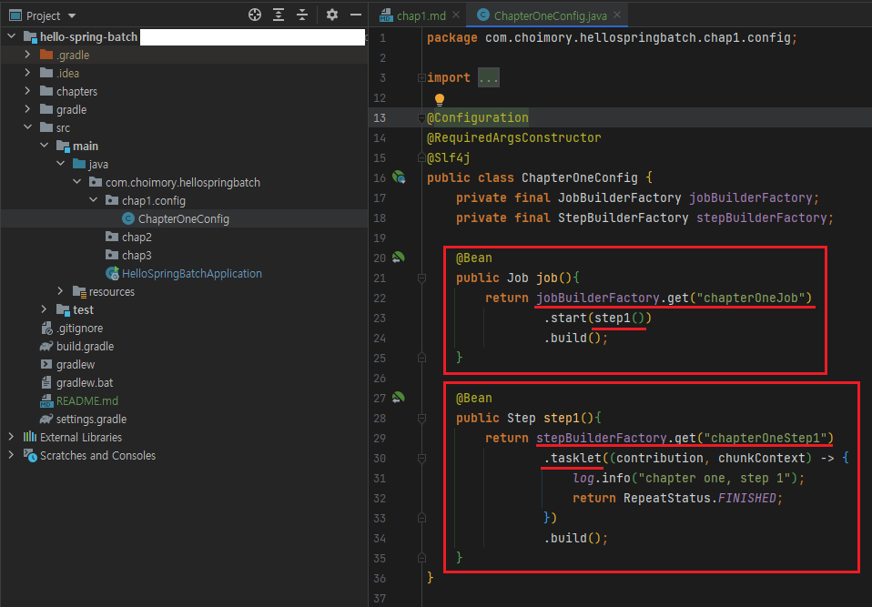

# Chap 1. 

## Batch 어플리케이션 등록

- Application.java 클래스에 `@EnableBatchProcessing`을 등록하여, 해당 앱을 Batch 어플리케이션으로 사용할 수 있음.

## Job 클래스 생성

    
- Spring batch의 모든 Job은 `@Configuration`으로 등록해 사용.

## Job, Step 및 이하 로직 생성

- `JobBuilderFactory.get("Job이름")`으로 Job을 생성할 수 있음.
- `StepBuilderFactory.get("Step이름")`으로 Step을 생성할 수 있음.
- `tasklet((contribution, chunkContext) -> {로직})`
  - Step 안에서 수행될 기능들을 명시.
  - Step 안에서 단일로 수행될 커스텀한 기능을 선언할때 사용할 수 있음.
  
## Job > Step > [Tasklet] or [Reader ~ (Processor) ~ Writer]

- 하나의 Job에 여러개의 Step을 진행한다
- 하나의 Step은 하나의 Tasklet 혹은 하나의 [Reader ~ (Processor) ~ Writer]를 진행한다
- [Reader(조회) ~ Processor(비즈니스 로직) ~ Writer(작성)] 단계 중 Processor 단계는 비즈니스 로직에 따라 생략이 가능하다
- Tasklet과 [Reader ~ Processor ~ Writer]은 하나의 Step에서 같이 진행될 수 없다 (Step 내 둘 중 택일하여 진행한다)

## Spring batch 메타 데이터 테이블

- Spring batch 어플리케이션을 실행하기 위해선, Spring batch 기본 테이블들이 반드시 필요.
- Spring batch 메타 데이터 테이블은 spring-batch-core.jar 파일의 schema-RDBMS명.sql 파일을 이용해 생성할 수 있음.
    - IDE 파일검색으로 `schema-`를 검색해보기.
    - H2에선 어플리케이션 실행시 자동 생성. 

# 출처

> https://jojoldu.tistory.com/325?category=902551