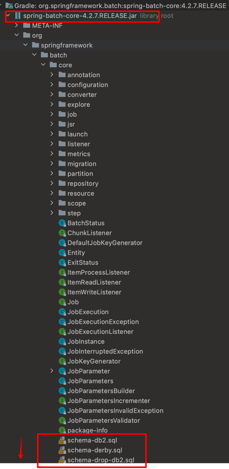

# Chap 2.

## Spring batch 메타 테이블

- Spring batch 어플리케이션을 실행하기 위해선, 사용되는 DB내에 Spring batch 메타 테이블들이 필수적으로 존재해야 한다
  - H2는 자동생성된다
- 메타 테이블들은 배치 어플리케이션 실행관련 정보를 담고 있다
    - 이전에 실행한 Job은 어떤것들이 있는지
    - 최근 실패한 Batch Parameter는 어떤것이고 성공한 Job은 어떤것들이 있는지
    - 다시 실행한다면 어디서부터 시작하면 되는지
    - 어떤 Job엔 어떤 Step들이 있었고, Step중 어느것이 성공했고 어느것지 실패했는지
    - 등등
- 
  - 메타테이블 생성 DDL 구문은 DBMS별로 spring-batch-core.jar 내에 존재하여 기본적으로 제공된다

## 메타 테이블 구조

주요 Spring batch 메타 테이블의 구조는 다음과 같다

- BATCH_JOB_INSTANCE
  - BATCH_JOB_EXECUTION
    - BATCH_JOB_EXECUTION_PARAMS
    - BATCH_JOB_EXECUTION_CONTEXT
    - BATCH_STEP_EXECUTION
      - BATCH_STEP_EXECUTION_CONTEXT
  
## BATCH_JOB_INSTANCE

- Job Parameter에 따라 생성되는 테이블
- Job Parameter는 Spring batch가 실행될때 외부에서 보낼수 있는 파라미터
- 같은 Job을 Job Parameter값이 다르면 계속 실행할 수 있지만, 같은 Job을 같은 Job Parameter 값으로는 다시 실행할 수 없음.
- 즉 동일한 Job이 Job parameter가 달라질때마다 그에 대한 Job Instance가 생성되는것이다. 
  - 어떻게 보면 Java의 동일한 Class가 필드의 값을 다르게하여 Instance를 생성되는것과 조금은 비슷한 느낌이다.
- 동일한 Job은 동일한 Job paramter로 복수번 실행할 수 없다
  - 단 해당 Job이 성공했을때의 이야기로, 실패했을땐 동일한 Job을 동일한 Job Param으로 다시 수행을 시도할 수 있다
    - 성공했을때만 Job Instance가 생성되기 때문이다

## BATCH_JOB_EXECUTION

- BATCH_JOB_INSTANCE가 성공/실패했던 모든 내역을 가지고 있는 자식 테이블

## BATCH_JOB_EXECUTION_PARAMS

- BATCH_JOB_EXECUTION이 기록될때 받은 Job Parameter 정보를 가지고 있는 자식 테이블

## Job, Job Instance, Job Execution 정리

- Job: `JobBuilderFactory.get()...build()`으로 생성하여 @Bean을 통해 스프링 빈으로 등록한 Spring batch Job
- Job Instance: 특정 Job Parameter로 실행한 Job
- Job Execution: 특정 Job Parameter로 실행한 Job의 시도들