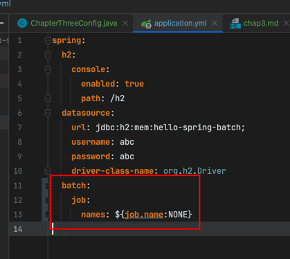
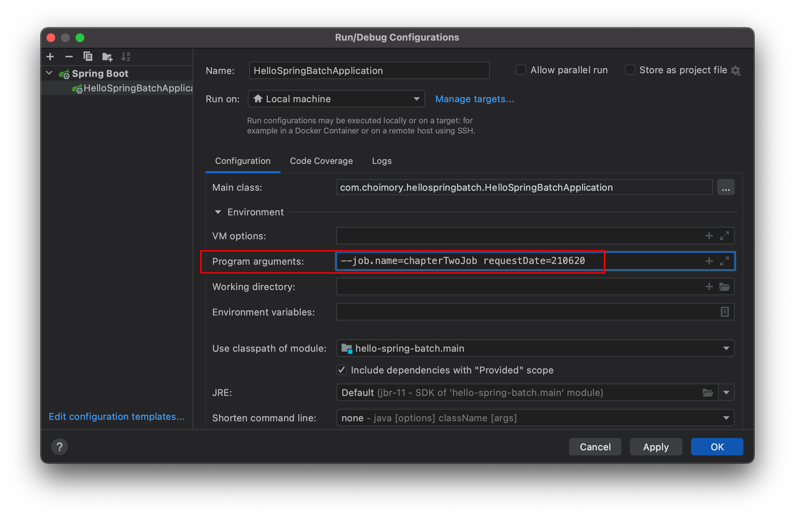
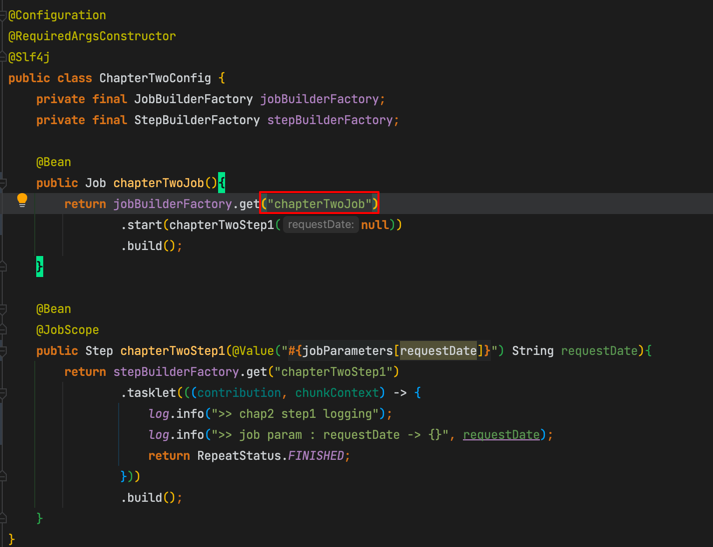
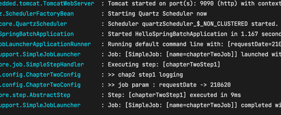
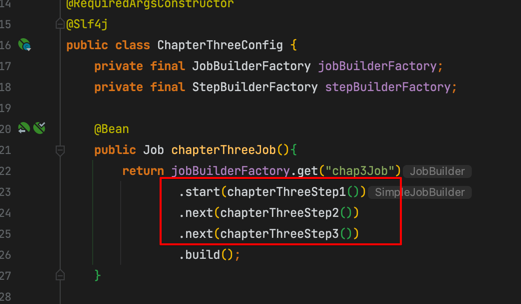
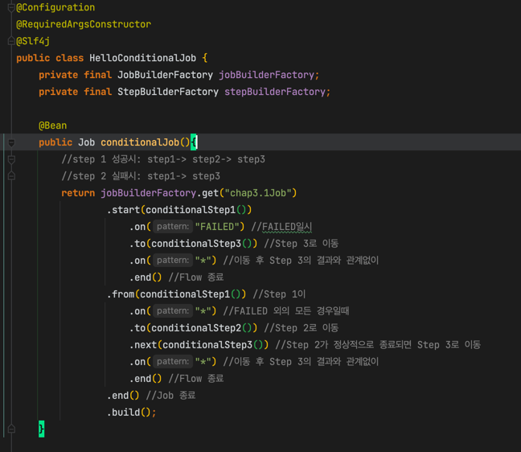
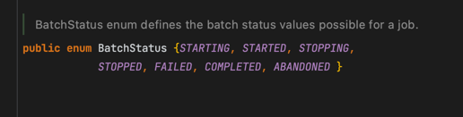
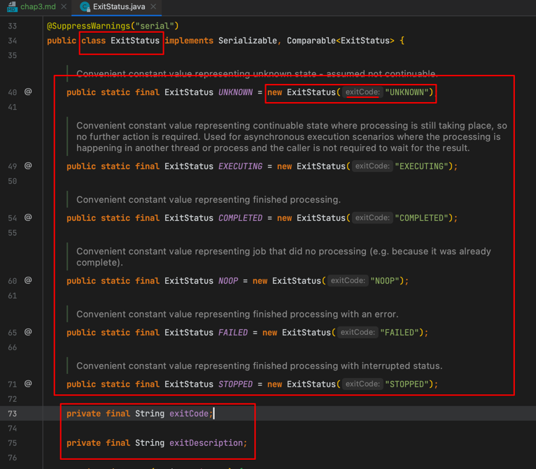

# Chap 3.

# 원하는 Job만 실행하기

- 설정에 `spring.batch.job.names: ${job.name:NONE}` 추가

- 실행환경 program args에 `--job.name=Job명` 추가
    
    - 여기서 Job명은 `JobBuilder.get("Job명")`
    

- 원하는 Job만 실행되었음

# Job Flow

## JobBuilder.next()

- Step을 순차적으로 연결시켜 실행할때 사용함

## FlowBuilder.on(), to(), from(), end()

- on()
    - 캐치할 ExitStatus 지정
        - BatchStatus가 아닌 ExitStatus가 판단의 기준이므로, 분기를 원할시 ExitStatus를 조정해주는 코드를 작성.
    - `*`일시 모든 ExitStatus
- to()
    - 다음 Step을 지정
- from()
    - on()과 함께 일종의 이벤트 리스너처럼 사용함. 
        - from()은 셀렉터, on()은 이벤트 리스너 느낌 
            - from(특정step).on(step상태).to(진행할step)
    - 상태값을 확인하여 일치한다면 to()의 step을 호출함
    - step1의 이벤트 캐치가 FAILED인 상태에서 추가로 캐치하려면 from()을 써야만 함
- end()
    - FlowBuilder를 반환하는 end()와 FlowBuilder를 종료하는 end() 두가지가 있음
        - on("*") 뒤에 있는 end()는 FlowBuilder를 반환하는 end
        - build() 앞에 있는 end()는 FlowBuilder를 종료하는 end
    - FlowBuilder를 반환하는 end()를 사용시 계속해서 from()을 이어갈 수 있음

## Batch Status, Exit Status

- BatchStatus: Spring BATCH 메타 테이블에 실행 결과를 기록할때 사용
- ExitStatus: FlowBuilder에서 Step 실행 결과를 판단할때 사용

### Batch Status

- Job 또는 Step의 실행 결과를 Spring 에서 기록할때 사용하는 Enum
- BATCH_JOB_EXECUTION 등 Spring batch 메타테이블에 실행결과를 기록될때 사용
    - COMPLETED, STARTING, STARTED, STOPPING, STOPPED, FAILED, ABANDONED, UNKNOWN

### Exit Status

- Step의 실행 후 상태코드값을 가지고 있는 객체 (enum 아님)
- FlowBuilder에서 Step 실행 후 상태를 판단할때 사용 (ExitStatus가 FAILED여도 일단 해당 Step은 끝까지 진행)

### Exit Status 커스터마이징 (extends StepExecutionListenerSupport)

> ExitStatus의 기본 제공 exitCode외에 별도의 exitCode를 사용하고 싶을때

- 방식이 번거롭고 복잡하여 크게 사용하지 않는다
- 고로 일단 생략 및 보류

### JobExecutionDecider

위의 방식은 몇가지 아쉬운 점이 존재한다. 

1. Step이 로직 외에 분기처리까지 진행해야 한다
2. 다양한 방식의 분기 로직을 처리하기 어렵다
    - 다양한 분기 로직을 위해서는 ExitStatus를 커스터마이징하기 위해 StepExecutionListenerSupport를 상속한 Listener를 생성하고 Job Flow에 등록하는 등 번거롭다

그래서 Spring Batch에서는 간단한 방식으로 Step들의 Flow 속에서 분기만 전적으로 담당하는 JobExecutionDecider가 존재한다

### JobExecutionDecider 구현

- JobExecutionDecider 인터페이스의 decide 메소드를 구현한다
- 메소드 구현부에 분기로직을 작성한뒤 결과에 따라 원하는 FlowExecutionStatus를 return 한다
    - 주의할점은 분기로직을 떼어와서 이제는 Step에서 처리하는것이 아니기 때문에 ExitStatus가 아닌 FlowExecutionStatus로 상태를 관리한다
    
# 출처

> https://jojoldu.tistory.com/328?category=902551