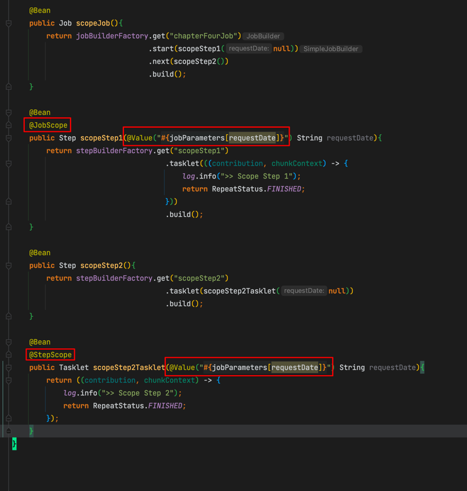
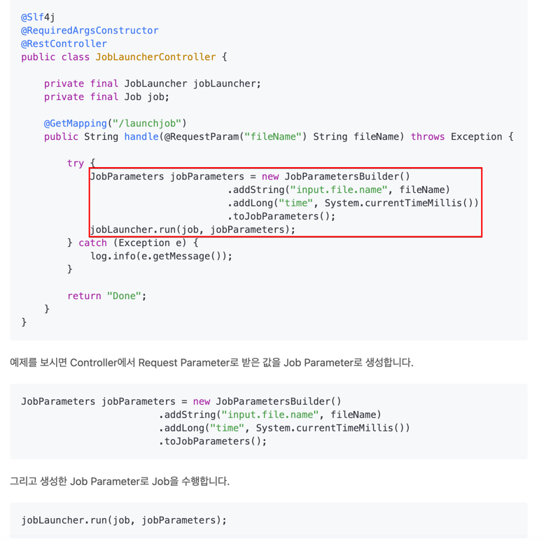

# Chap 4.

# Job Parameter

- Spring batch는 Job Parameter라는 내외부에서 파라미터를 받아 여러 Batch 컴포넌트에서 사용할 수 있다.
- 사용법은 매개변수 옆에 `@Value("#{jobParameters[변수명]}")` 어노테이션과 함께 SpEL로 선언
- Job Parameter를 사용하기 위해선 반드시 Spring batch 전용 Scope(@Job|StepScope)를 선언해주어야만 한다
- Job Parameter 타입으로 사용 가능한것은 Double, Long, Date, String이 있다
    - LocalDateTime류는 String으로 받아 형변환하여야 한다

# @JobScope, @StepScope

- Step을 반환하는 스텝 메소드에는 `@JobScope`를 지정해준다.
- Tasklet 혹은 Chunk를 반환하는 메소드에는 `@StepScope`를 지정해준다.
- @Job|StepScope 어노테이션은 @Bean의 생성 시점을 @Job|StepScope가 실행되는 시점으로 지연시킨다
    1. 이로인해 Job Parameter의 Late Binding(배포시점이 아닌 요청시점에 파라미터 바인딩)을 가능케함
    2. 동일한 컴포넌트를 병렬로 사용하거나 아예 동시에 사용할때 유용함

# Job Parameter 상세

- Job Parameter는 @Job|StepScope Bean을 생성할때만 Job Parameter가 생성된다
- 메소드에 @Bean과 @Job|StepScope를 붙이고 매개변수에 @Value를 사용하면? -> Job Parameter를 받을 수 있다
- 클래스에 @Component와 @Job|StepScope를 붙이고 필드에 @Value를 사용하면? -> Job Parameter를 받을 수 있다
- @Bean이나 @Component를 @Job|StepScope 없이 생성하고 @Value를 사용하면? -> Job Parameter를 받을 수 없다

# Job Parameter vs 시스템 변수

- Job Parameter 대신 환경변수(program args)나 시스템 변수(application.yml)를 활용하면 안되는건가?
- java jar application.jar -D파라미터로 시스템 변수를 지정해 사용하면 안되는건가?

-> 

- 사용시 Spring batch의 Job Parameter와 관련된 기능들을 사용할 수 없게 됨
    - 이를테면 같은 Job Parameter로 여러 Job Instance를 사용하지 못하게 하는 기능
    - Spring batch 메타 테이블이 관리가 곤란해지는 상태가 된다
- CLI 외 다른 방법으로 Job을 실행하기 어려워진다 
- 테스트코드로 Job을 실행할시 문제가 발생할 수 있다
- Late Binding을 못하게 된다
    
    - 이를테면 웹서버에서 batch를 수행할시 Job parameter를 이용하면 request param으로 job param을 생성해 실행할 수 있다.
      - 물론 웹서버에서 batch를 관리하는것은 권장되지 않는다
    - 하지만 환경변수로 한다면 배포시기에 건낼수 밖에 없다
    

